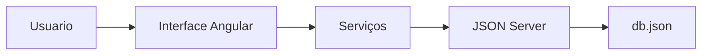
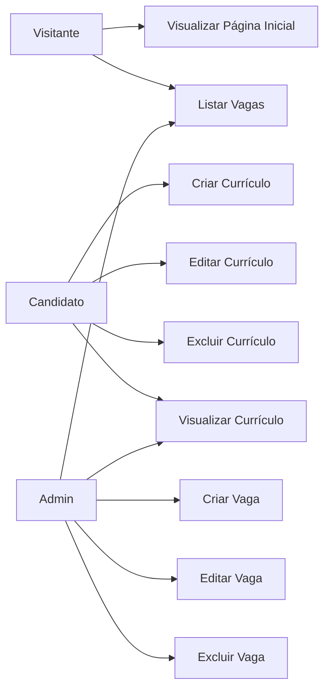
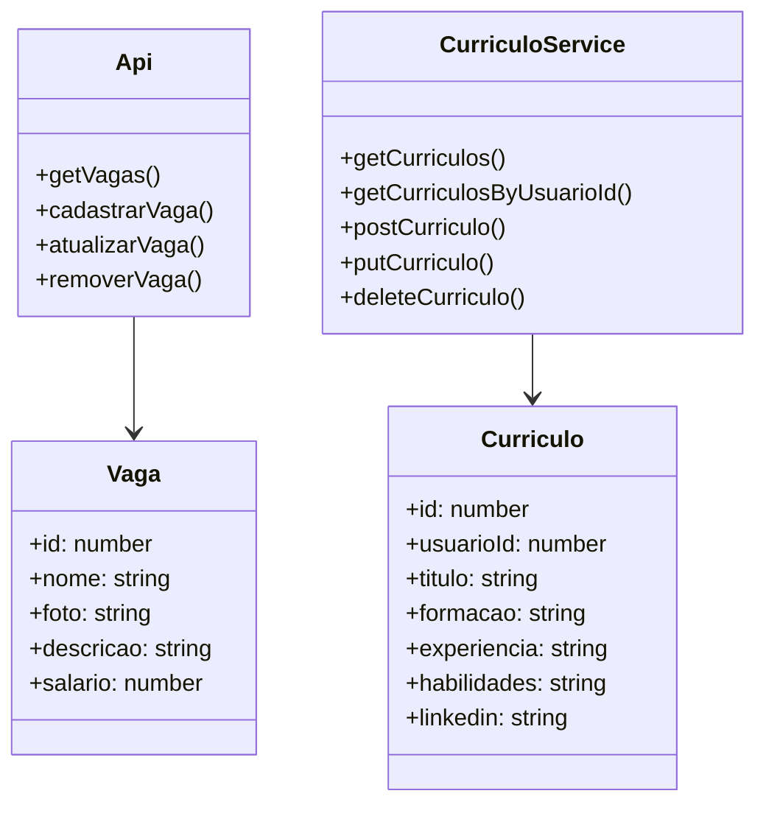

# Documentação de Especificação de Requisitos de Software (SRS)

Documento baseado na ISO/IEC/IEEE 29148:2018

# 💼 Plataforma RH

**Padrão:** ISO/IEC/IEEE 29148:2018  
**Versão:** 1.1.0  
**Data:** 2026-06-23  
**Autor:** LuanBasani

---

# 1. Introdução

## 1.1 Propósito

Este documento descreve o sistema **Plataforma RH**, composto pelos módulos de gerenciamento de vagas e currículos, com o objetivo de:

- Definir funcionalidades do sistema
- Padronizar entendimento entre stakeholders
- Servir como base para desenvolvimento, testes e manutenção

---

## 1.2 Escopo

O sistema permite:

### Módulo de Vagas

- Visualização de vagas disponíveis
- Cadastro de vagas
- Edição de vagas
- Exclusão de vagas

### Módulo de Currículos

- Cadastro de currículos
- Edição de currículos
- Exclusão de currículos
- Visualização de currículos

### Persistência

- Armazenamento de dados utilizando JSON Server

O sistema foi desenvolvido utilizando:

- Angular 21.2.0
- TypeScript 5.9.2
- RxJS 7.8.0
- JSON Server
- HTML5
- SCSS

---

## 1.3 Definições

| Termo | Definição |
|---------|---------|
| Vaga | Oportunidade de emprego cadastrada na plataforma |
| Currículo | Conjunto de informações profissionais do candidato |
| Administrador | Usuário responsável pelo gerenciamento de vagas |
| Candidato | Usuário responsável pelo gerenciamento de currículos |
| API | Interface de comunicação entre frontend e backend |
| JSON Server | Backend simulado baseado em arquivo JSON |

### Acrônimos

- RF — Requisito Funcional
- RNF — Requisito Não Funcional
- LR — Regra de Negócio
- CRUD — Create, Read, Update e Delete

---

# 2. Descrição Geral do Sistema

## 2.1 Perspectiva do Sistema



---

## 2.2 Funções do Sistema

O sistema deve:

### Vagas

- Listar vagas disponíveis
- Criar novas vagas
- Editar vagas existentes
- Excluir vagas

### Currículos

- Criar currículos
- Editar currículos
- Excluir currículos
- Visualizar currículos

### Sistema

- Persistir dados no backend
- Exibir feedback ao usuário
- Atualizar informações em tempo real após operações CRUD

---

## 2.3 Classes de Usuários

| Usuário | Descrição |
|---------|---------|
| Visitante | Visualiza vagas disponíveis |
| Candidato | Cadastra, edita, visualiza e exclui currículos |
| Administrador | Gerencia vagas e visualiza currículos cadastrados |

---

## 2.4 Ambiente Operacional

- Navegador Web moderno (Chrome, Firefox, Safari, Edge)
- Node.js 16+
- Angular CLI 21.2.13
- Sistema Operacional Windows, Linux ou macOS

---

## 2.5 Restrições

- Sistema executado localmente
- Sem autenticação de usuários
- Usuário logado simulado via `usuarioId`
- Sem integração com APIs externas
- Backend simulado utilizando JSON Server

---

## 2.6 Suposições

- Navegador com JavaScript habilitado
- JSON Server executando na porta 3010
- Usuário possui acesso ao ambiente de desenvolvimento

---

# 3. Requisitos do Sistema

## 3.1 Requisitos Funcionais

### RF-001 — Listar Vagas

**Descrição:** Permitir visualização de todas as vagas disponíveis.

**Critérios de Aceitação:**

- Buscar vagas do backend
- Exibir nome, foto, descrição e salário
- Carregamento automático ao abrir a página

---

### RF-002 — Criar Vaga

**Descrição:** Permitir cadastro de novas vagas.

**Critérios de Aceitação:**

- Nome obrigatório
- Foto obrigatória
- Descrição obrigatória
- Salário obrigatório
- Feedback ao usuário

---

### RF-003 — Editar Vaga

**Descrição:** Permitir alteração de vagas existentes.

**Critérios de Aceitação:**

- Selecionar vaga
- Atualizar informações
- Persistir alterações no backend

---

### RF-004 — Excluir Vaga

**Descrição:** Permitir remoção de vagas.

**Critérios de Aceitação:**

- Solicitar confirmação
- Remover do backend
- Atualizar listagem automaticamente

---

### RF-005 — Criar Currículo

**Descrição:** Permitir cadastro de currículos.

**Critérios de Aceitação:**

- Título obrigatório
- Formação obrigatória
- Experiência obrigatória
- Habilidades obrigatórias
- LinkedIn opcional
- Vinculação através de usuarioId

---

### RF-006 — Editar Currículo

**Descrição:** Permitir edição de currículos existentes.

**Critérios de Aceitação:**

- Selecionar currículo
- Carregar dados no formulário
- Atualizar backend

---

### RF-007 — Excluir Currículo

**Descrição:** Permitir exclusão de currículos.

**Critérios de Aceitação:**

- Solicitar confirmação
- Remover currículo do backend
- Atualizar listagem

---

### RF-008 — Listar Currículos

**Descrição:** Permitir visualização de currículos cadastrados.

**Critérios de Aceitação:**

- Buscar dados do backend
- Exibir título, formação e habilidades

---

### RF-009 — Vincular Currículo ao Usuário

**Descrição:** Todo currículo deve pertencer a um usuário.

**Critérios de Aceitação:**

- Utilizar campo `usuarioId`
- Associar currículo ao usuário logado

---

## 3.2 Requisitos Não Funcionais

### RNF-001 — Responsividade

O sistema deve funcionar em diferentes resoluções de tela.

---

### RNF-002 — Desempenho

Tempo de carregamento inferior a 2 segundos em ambiente local.

---

### RNF-003 — Persistência de Dados

Utilizar JSON Server com armazenamento em `db.json`.

---

### RNF-004 — Framework

Utilização do Angular 21 com TypeScript.

---

### RNF-005 — Organização do Código

Separação entre:

- Componentes
- Serviços
- Modelos

---

# 4. Regras de Negócio

| Código | Regra |
|----------|----------|
| LR-001 | Todos os campos da vaga são obrigatórios |
| LR-002 | Salário deve ser numérico |
| LR-003 | Vagas removidas não podem ser recuperadas |
| LR-004 | Lista de vagas deve ser atualizada após alterações |
| LR-005 | Sistema utiliza JSON Server na porta 3010 |
| LR-006 | Todo currículo deve possuir usuarioId |
| LR-007 | Título do currículo é obrigatório |
| LR-008 | Formação é obrigatória |
| LR-009 | Experiência é obrigatória |
| LR-010 | Habilidades são obrigatórias |

---

# 5. Modelos do Sistema

## 5.1 Diagrama de Casos de Uso



---

## 5.2 Diagrama de Classes



---

# 6. Estrutura do Projeto

```txt
src/
└── app/
    ├── model/
    │   ├── vaga.ts
    │   └── curriculo.ts
    │
    ├── service/
    │   ├── api.ts
    │   └── curriculo.service.ts
    │
    ├── view/
    │   ├── inicio/
    │   ├── vagas/
    │   ├── painel-vagas/
    │   ├── painel-curriculos/
    │   └── fragmentos/
    │
    ├── app.routes.ts
    └── app.ts
```

---

# 7. Banco de Dados

Localização:

```txt
backend/db.json
```

### Estrutura

```json
{
  "vagas": [],
  "curriculos": []
}
```

---

# 8. Como Executar

### Instalar dependências

```bash
npm install
```

### Iniciar JSON Server

```bash
npx json-server --watch backend/db.json --port 3010
```

### Iniciar Angular

```bash
ng serve
```

### Acessar

```txt
http://localhost:4200
```

---

# 9. Análise de Risco

| Risco | Impacto | Mitigação |
|---------|---------|---------|
| Falha do JSON Server | Alto | Reiniciar serviço |
| Dados inválidos | Médio | Validação dos formulários |
| Inconsistência de dados | Médio | Atualização automática das listas |
| Corrupção do db.json | Alto | Backup periódico |

---

# 10. Controle de Versão

| Versão | Data | Autor | Alteração |
|---------|---------|---------|---------|
| 1.0.0 | 2026-06-11 | LuanBasani | CRUD de vagas |
| 1.1.0 | 2026-06-23 | LuanBasani | Implementação do módulo de currículos |

---

# 11. Funcionalidades Implementadas

## Vagas

- Listagem de vagas
- Cadastro de vagas
- Edição de vagas
- Exclusão de vagas

## Currículos

- Cadastro de currículos
- Edição de currículos
- Exclusão de currículos
- Listagem de currículos
- Vinculação por usuarioId

## Sistema

- Componentes Header e Footer
- Roteamento Angular
- Integração com JSON Server
- Serviços HTTP (GET, POST, PUT e DELETE)
- Validação de campos obrigatórios
- Feedback visual ao usuário
- Persistência de dados local
